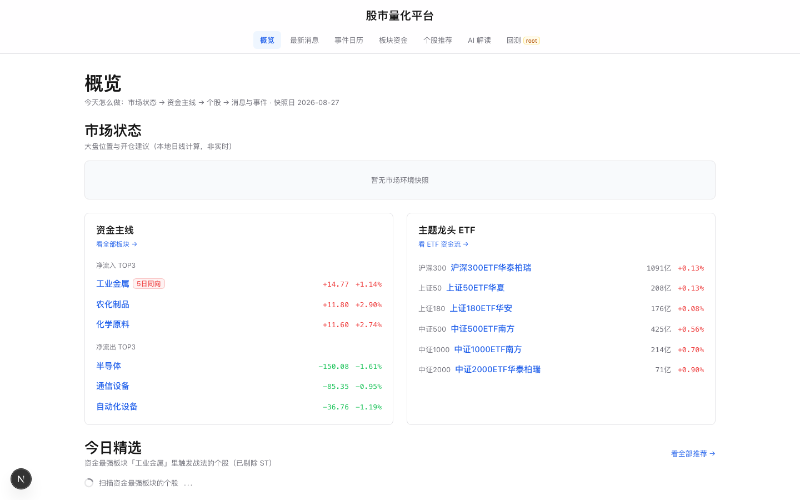
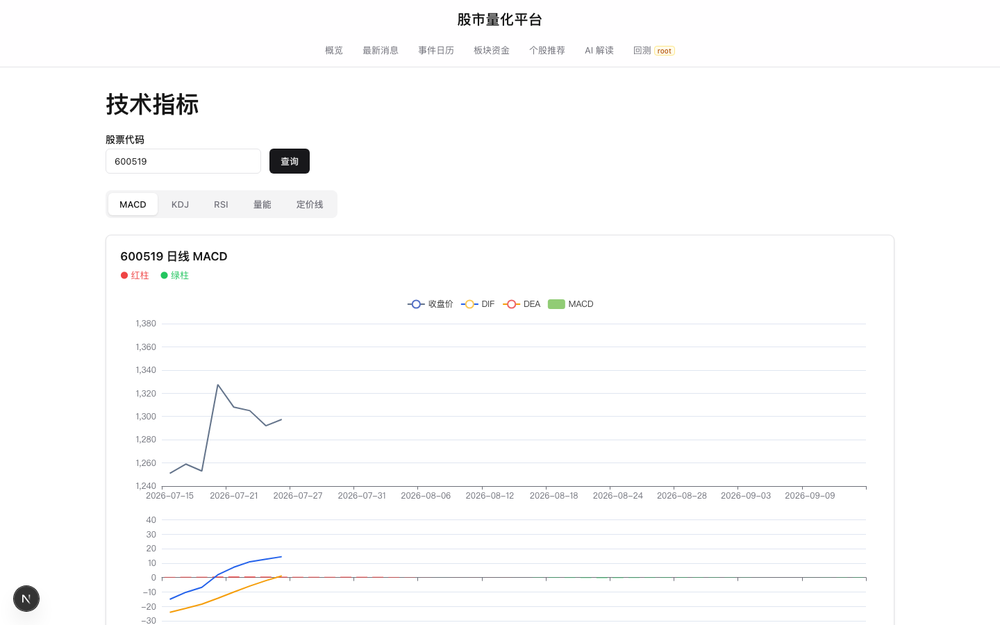
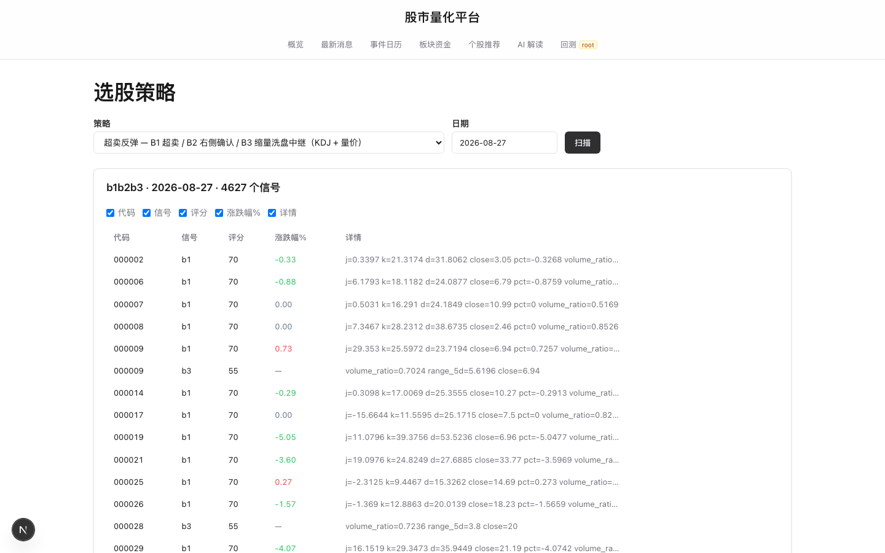
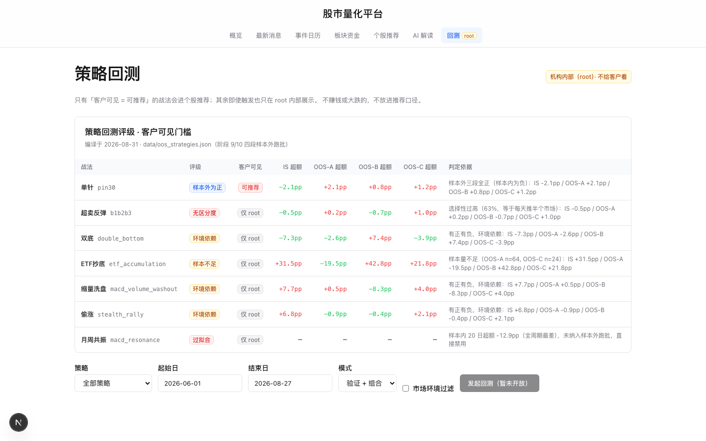
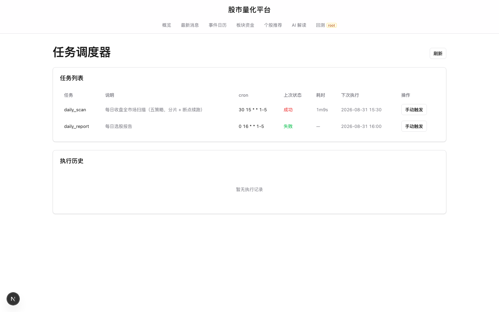

# A股量化研究平台

面向 A 股投资者的量化研究平台，将技术指标分析、选股、回测与盯盘等传统人工操作，整合为一个可视化、可自动化的网页工具。

> 平台定位：将散户常用的「通达信数据 + MACD/KDJ 指标 + 选股 + 回测」手动流程，工程化为可查看、可验证、可自动化执行、并具备 AI 解读能力的专业工具。

## 平台价值

| 用户需求 | 平台能力 |
|---------|---------|
| 分析个股需在多款软件间切换 | 输入 6 位代码，MACD / KDJ / RSI / 量能指标一键呈现 |
| 难以快速筛选值得关注的标的 | 多套选股策略自动扫描全市场，触发信号的标的按评分排序 |
| 选股依赖主观判断、缺乏依据 | 回测引擎基于历史数据验证，净值、胜率、超额收益以数据呈现 |
| 每日重复性看盘与记录 | 定时任务自动执行扫描与报告生成 |
| 难以理解专业信号术语 | AI 解读将信号转化为通俗易懂的自然语言，说明含义、操作建议与风险 |
| 无法及时掌握市场动态 | 财经快讯与宏观事件日历，提前梳理重要事件 |

## 核心功能

**技术指标** — 提供 MACD / KDJ / RSI / 量能等指标，输入代码即出图，趋势、超买超卖、量价关系一目了然。

**选股策略** — 内置超卖反弹、月线共振、单针下30、水下二次金叉偷涨、双底背离、ETF 吸筹等多套策略，全市场自动扫描。

**策略回测** — 基于历史数据对策略进行回测，输出净值曲线、超额胜率（策略胜率 − 同期基线）、收益分布、衰减曲线等，以数据支撑决策。

**定时任务** — 支持每日扫描、报告生成、数据更新等任务的自动化执行。

**AI 解读** — 接入大语言模型，将触发的战法信号转化为通俗解读，说明信号含义、操作建议与风险提示。

**市场资讯** — 提供财经快讯（支持定时更新）与宏观事件日历（FOMC / CPI / 非农 / 财报季），帮助用户把握市场节奏。

## 界面预览

**首页概览** — 市场状态、资金主线、个股信号、要闻与事件，一页看清「今天怎么做」。



**技术指标** — 输入代码即出图。



**选股策略** — 全市场扫描结果。



**策略回测** — 评级表与回测入口。



**任务调度** — 自动化任务。



## 快速开始

未配置真实行情数据也可体验（内置演示数据）：

```bash
make install                                   # 安装依赖
.venv/bin/python scripts/seed_demo_data.py      # 生成演示数据
STOCK_HSJDAY_ROOT="$PWD/data/demo_hsjday" \
  .venv/bin/uvicorn main:app --app-dir apps/api/src --port 8000   # 启动后端
cd apps/web && npm install && npm run dev       # 启动前端（另开终端）
# 浏览器访问 http://localhost:3000
```

如已配置通达信数据，将 `STOCK_HSJDAY_ROOT` 指向实际数据目录即可。

## 工程可信度

- 完整测试覆盖：后端 247 项 + 前端 47 项 + 端到端 5 条关键路径
- 指标公式以真实行情逐点比对验证（精确至 4 位小数）
- 回测采用「超额胜率」口径（策略胜率 − 同期基线），避免以 50% 作为基准造成的偏差
- 前端 Next.js + ECharts，后端 Python FastAPI，MySQL 存储，支持 Docker 一键部署

## 说明

本平台定位为**研究工具**，旨在帮助用户构建量化研究流程、客观评估策略表现，**不构成任何收益承诺**。策略表现以回测数据为准；工具本身具备可测试、可复现、可部署的特性。

> 技术细节（目录结构 / API / Docker 运维 / 测试）见 [docs/DEVELOPMENT.md](docs/DEVELOPMENT.md)。
