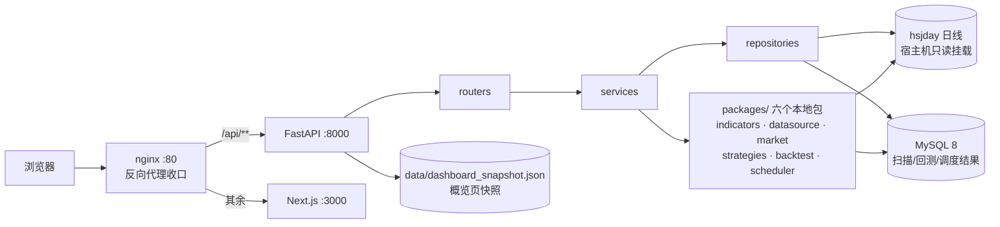

# 股市量化平台

一个前后端分离的 A股 量化研究平台：**FastAPI 后端** 读本地通达信 hsjday 日线数据做
技术指标 / 选股策略 / 回测 / 调度，**Next.js + Tailwind + ECharts 前端** 提供概览看板
与各功能页，中间用 **nginx** 收口、**MySQL** 落库。

> 一句话定位：把散户常用的「通达信数据 + MACD/KDJ 指标 + 选股 + 回测 + 定时跑批」
> 手工流程，工程化成一个能测试、能部署、别人 clone 下来就能跑的项目。

## 功能一览

| 页面 | 路由 | 说明 |
| --- | --- | --- |
| 概览看板 | `/` | 各策略当日信号数 / 选择性 / 超额胜率 + 市场基线 + 最近扫描与调度状态 |
| 技术指标 | `/indicators` | MACD / KDJ / RSI / 量能，输入代码即出图（ECharts） |
| 选股策略 | `/strategies` | 六策略扫描结果表（排序 / 列切换 / 点击看该股指标图） |
| 策略回测 | `/backtest` | 净值曲线 / 超额胜率对比 / 收益分布 / 衰减 / 信号叠加矩阵 / 明细 |
| 任务调度 | `/scheduler` | 每日扫描 / 报告 / ETL 任务列表 + 执行历史 + 手动触发 |

内置六套 A股选股策略（`packages/strategies/`）：`b1b2b3`（KDJ+量价）、`macd_resonance`
（月线水上 + 周线金叉）、`pin30`（单针下30）、`stealth_rally`（水下二次金叉偷涨）、
`double_bottom`（双底齐平 + 底背离 + 缩量二次探底）、`etf_accumulation`（ETF 跌幅
25%-40% + 底背离）。

## 目录结构

```
stock-quantitative-analysis/
├── apps/
│   ├── api/                      # FastAPI 后端
│   │   ├── src/{main,config,errors,routers,schemas,services,repositories}
│   │   ├── migrations/           # MySQL 建表 SQL
│   │   ├── tests/                # API 集成测试
│   │   └── Dockerfile
│   └── web/                      # Next.js 前端
│       ├── src/{app,components,features,lib,styles}
│       ├── tests/                # vitest 组件/单测
│       ├── e2e/                  # Playwright 端到端测试
│       ├── playwright.config.ts
│       └── Dockerfile
├── packages/                     # 六个本地 Python 包（可独立单测）
│   ├── indicators/               # MACD / KDJ / RSI / 量能（纯函数）
│   ├── datasource/               # 通达信 hsjday 只读解析
│   ├── market/                   # 交易日历 / 涨跌停 / 复权
│   ├── strategies/               # 六策略 + 全市场扫描器
│   ├── backtest/                 # 回测引擎 + 基线（超额胜率口径）
│   └── scheduler/                # 调度器（任务注册 / 执行 / 分片断点）
├── data/                         # 演示数据 + 概览页快照（.gitignore 忽略，由 seed_demo_data.py 现场生成）
├── tests/                        # 后端单元 + 集成测试 + fixtures
├── scripts/                      # 生成 fixtures / 快照 / 演示数据的脚本
├── docs/                         # 各阶段迁移说明（口径与结论）
├── docker-compose.yml            # 一键起整套服务
├── nginx.conf                    # 反向代理网关配置
├── Makefile                      # 开发命令入口
└── pyproject.toml                # 根目录 pytest 配置
```

## 架构总览

浏览器只访问 nginx（80 端口），由它按路径分流：`/api/**` → FastAPI，其余 → Next.js。
后端 FastAPI 走「routers → services → repositories」三层，业务逻辑落在六个本地 Python
包（指标/数据源/市场/策略/回测/调度），只读 hsjday 日线 + MySQL 落库。



## 快速开始（没有真实数据也能跑）

面试 / 演示环境大概率没有通达信 hsjday 数据。项目提供一条「30 秒看到页面在跑」的降级路径：

```bash
# 0. 后端依赖（清华源，顺序别乱：先六个本地包再 api）
make install

# 1. 生成演示数据（约 38 只虚构标的的合成日线）+ 概览页快照
.venv/bin/python scripts/seed_demo_data.py

# 2. 起后端（指向演示数据）
STOCK_HSJDAY_ROOT="$PWD/data/demo_hsjday" .venv/bin/uvicorn main:app \
    --app-dir apps/api/src --port 8000

# 3. 起前端（另开一个终端）
cd apps/web && npm install && npm run dev
# 打开 http://localhost:3000
```

这样指标 / 选股 / 回测 / 概览页都能体验；调度页在无 MySQL 时任务列表为空（本地起
MySQL 见下文 docker 一节）。有真实数据时，把 `STOCK_HSJDAY_ROOT` 指向真实 hsjday 目录，
并跑 `.venv/bin/python scripts/make_dashboard_snapshot.py` 重新生成真实回测快照。

## 环境变量（`.env`）

复制 `.env.example` 为 `.env` 后按需修改。每个变量干什么、怎么获取、不填会怎样，
都写在 `.env.example` 的注释里。核心变量：

- `STOCK_HSJDAY_ROOT` —— hsjday 日线根目录（不填用默认 `~/Desktop/每日复盘/hsjday`）
- `STOCK_DASHBOARD_SNAPSHOT_PATH` —— 概览页快照路径（不填用仓库内 `data/dashboard_snapshot.json`，由 seed_demo_data.py 生成）
- `STOCK_CORS_ORIGINS` —— 跨域来源（不填默认 `http://localhost:3000`）
- `STOCK_FEISHU_WEBHOOK_URL` —— 飞书机器人 webhook（不填则只写本地报告、不发飞书）

## API

统一响应结构 `{ message, body }`：

| 方法 | 路径 | 说明 |
| --- | --- | --- |
| GET | `/api/v1/health` | 健康检查 |
| GET | `/api/v1/dashboard/overview` | 概览页聚合数据（快照 + 调度状态） |
| GET | `/api/v1/indicators/{macd,kdj,rsi,volume}?symbol=...` | 指标序列 |
| GET | `/api/v1/strategies` | 策略列表 |
| GET | `/api/v1/strategies/{name}/scan?date=YYYY-MM-DD` | 执行（或读取）策略扫描 |
| GET | `/api/v1/strategies/{name}/signals?from=&to=` | 历史信号 |
| POST | `/api/v1/backtest/runs` | 发起回测 |
| GET | `/api/v1/backtest/runs/{run_id}` | 查询回测结果 |
| GET | `/api/v1/backtest/decay?strategy=...` | 策略衰减曲线 |
| GET | `/api/v1/scheduler/jobs` / `/runs` | 任务列表 / 执行历史 |
| POST | `/api/v1/scheduler/jobs/{name}/trigger` | 手动触发任务 |

错误语义：代码不存在 `404`、参数校验 `422`、领域错误 `400`，统一 `{ message }`。

## 测试

```bash
# 后端（单元 + 集成，247 个用例）
make test

# 前端（vitest，47 个用例）
cd apps/web && npm test

# 端到端（Playwright + Chromium，需先跑 seed_demo_data.py 生成演示数据）
cd apps/web && npx playwright test
```

覆盖要点：

- **指标黄金值**：MACD/KDJ/RSI/量能 逐点比对真实 600519 切片（精确到 4 位小数），锁死公式。
- **策略一致性**：六策略快照 + 一致性测试（新旧实现同结果）。
- **回测口径**：超额胜率 = 策略胜率 − 同期同宇宙基线胜率（详见 `docs/回测迁移说明.md`），
  单测锁死「不用 50% 当基准」的方法论修正。
- **调度器**：cron 解析 / 执行器 / 分片断点 / 通知器单测。
- **E2E**：五条关键路径（概览 / 指标切换 / 选股排序 / 回测 / 调度）+ 后端 404 友好提示。

## README 截图

跑 `npx playwright test` 时会顺便生成 5 张截图到 `docs/screenshots/`（1440x900）：

`dashboard.png`（概览）、`indicators.png`（指标图）、`strategies.png`（选股表）、
`backtest.png`（回测含超额对比）、`scheduler.png`（调度任务）。截图用的是演示数据，
不含任何真实持仓信息。

## 运维文件说明（写给新手）

### Docker 是什么

Docker 把「代码 + 运行环境」打包成一个**镜像（image）**，像一份完整的安装包；
用镜像启动出来的运行实例叫**容器（container）**。好处是：你 Mac 上能跑的，
服务器上也能原样跑。

- `Dockerfile`：**如何构建镜像**的说明书（装什么依赖、复制哪些文件、启动什么命令）。
- `docker-compose.yml`：**如何编排多个容器**（数据库 + 后端 + 前端 + 网关一起起）。

### docker-compose 里每个 service 的作用

| service | 干什么 | 为什么需要 |
| --- | --- | --- |
| `mysql` | 跑 MySQL 8 数据库 | 存扫描结果 / 回测 / 调度执行记录（migrations 首次启动自动执行） |
| `api` | 跑 FastAPI 后端 | 处理 `/api/v1/**`；挂载宿主机 hsjday 只读目录进来读 |
| `web` | 跑 Next.js 前端 | 渲染页面和图表，只对内暴露 3000 端口 |
| `nginx` | 反向代理网关（唯一对外 80 端口） | 收口端口、按路径转发、解决跨域 |

每个 service 都有 `healthcheck`，`depends_on` 用 `condition: service_healthy` 保证
「数据库没就绪、后端不启动；后端没就绪、网关不启动」，MySQL 数据用命名卷 `mysql-data`
持久化。

### nginx 承担什么角色

nginx 在这里不是「网站服务器」，而是**反向代理**：

1. **端口收口**：对外只开 80，内部 8000（后端）/3000（前端）不暴露。
2. **路径分流**：`/api/**` → 转给后端，其余 → 转给前端。
3. **同源访问**：页面和接口都从 `http://localhost` 一个地址出去，天然没有跨域问题。

### 一键起整套服务

```bash
docker compose up -d --build
curl http://localhost/api/v1/health   # → FastAPI
curl http://localhost/                 # → Next.js
docker compose down                    # 停掉
```

## 技术选型与风格说明

- **前端**：Next.js 15 + React 19 + Tailwind CSS v4 + shadcn 风格组件 + ECharts + TanStack Table。
- **后端**：FastAPI + Pydantic v2，三层（routers → services → repositories）+ 领域异常映射 HTTP。
- **测试**：pytest（Python）+ vitest（TS 组件/单测）+ Playwright（E2E）。
- **代码风格**：Python `main()` + UPPER_SNAKE 常量 + 中文注释；TS 无分号/单引号/2 空格，
  `interface` vs `type` 分工、`[err, res]` 元组封装 HTTP。
- **语义色**：A股红涨绿跌（`up`/`down`/`neutral`），集中在 `globals.css` 的 `@theme` 与
  `styles/colors.ts`，组件里禁止散落 hex。

## 遗留 TODO

- 回测组合层 3-2-2-2 分步建仓、止盈止损用盘中高低点（当前收盘价近似）。
- 真实行业板块（当前按市场板块简化）、复权因子接入。
- 调度器需要本地/服务器跑常驻循环进程 + 接飞书通知的完整部署说明。
