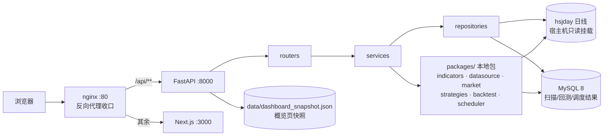

# 开发者文档（技术细节）

> 面向开发者 / 面试的技术细节。产品向介绍见 [README.md](../README.md)。

## 目录结构

```
stock-quantitative-analysis/
├── apps/
│   ├── api/                      # FastAPI 后端
│   │   ├── src/{main,config,errors,routers,schemas,services,repositories}
│   │   ├── migrations/           # MySQL 建表 SQL
│   │   ├── tests/                # API 集成测试
│   │   └── Dockerfile
│   └── web/                      # Next.js 前端
│       ├── src/{app,components,features,lib,styles}
│       ├── tests/                # vitest 组件/单测
│       ├── e2e/                  # Playwright 端到端测试
│       ├── playwright.config.ts
│       └── Dockerfile
├── packages/                     # 本地 Python 包（可独立单测）
│   ├── indicators/               # MACD / KDJ / RSI / 量能（纯函数）
│   ├── datasource/               # 通达信 hsjday 只读解析
│   ├── market/                   # 交易日历 / 涨跌停 / 复权
│   ├── strategies/               # 选股策略 + 全市场扫描器
│   ├── backtest/                 # 回测引擎 + 基线（超额胜率口径）
│   └── scheduler/                # 调度器（任务注册 / 执行 / 分片断点）
├── data/                         # 演示数据 + 快照（.gitignore 忽略）
├── tests/                        # 后端单元 + 集成测试 + fixtures
├── scripts/                      # 快照 / 演示数据 / 数据采集脚本
├── docs/                         # 开发者文档（本文件所在）
├── docker-compose.yml            # 一键起整套服务
├── nginx.conf                    # 反向代理网关配置
├── Makefile                      # 开发命令入口
└── pyproject.toml                # 根目录 pytest 配置
```

## 架构总览

浏览器只访问 nginx（80 端口），由它按路径分流：`/api/**` → FastAPI，其余 → Next.js。
后端 FastAPI 走「routers → services → repositories」三层，业务逻辑落在本地 Python
包（指标/数据源/市场/策略/回测/调度），只读 hsjday 日线 + MySQL 落库。



## AI 能力（Agent + 多模型）

- `services/llm_service.py`：封装 DeepSeek（OpenAI 兼容），单轮 `chat` + 带工具的 `chat_message`。
- `services/agent_service.py`：手写 ReAct Agent（不依赖 LangChain），Function Calling 挂 4 个工具——`get_indicators`（技术指标）、`get_signals`（战法信号）、`list_strategies`（战法列表）、`retrieve_context`（RAG 检索）。
- `services/multi_model_service.py`：多模型并行研判（MoA）——DeepSeek + 通义千问并行分析，主模型聚合并标注分歧，单模型失败自动降级。
- `services/rag_service.py`：轻量 RAG（字符二元组 BM25），语料 = 策略定义 + 财经消息 + 事件日历。

端点：`POST /api/v1/ai/interpret`（单模型解读）、`POST /api/v1/ai/agent`（Agent 问答）。

## 环境变量（`.env`）

复制 `.env.example` 为 `.env` 后按需修改。核心变量：

- `STOCK_HSJDAY_ROOT` —— hsjday 日线根目录（不填用默认 `~/Desktop/每日复盘/hsjday`）
- `STOCK_DASHBOARD_SNAPSHOT_PATH` —— 概览页快照路径（不填用仓库内 `data/dashboard_snapshot.json`）
- `STOCK_CORS_ORIGINS` —— 跨域来源（不填默认 `http://localhost:3000`）
- `STOCK_FEISHU_WEBHOOK_URL` —— 飞书机器人 webhook（不填则只写本地报告、不发飞书）
- `STOCK_DEEPSEEK_API_KEY` / `STOCK_DEEPSEEK_BASE_URL` / `STOCK_DEEPSEEK_MODEL` —— AI 解读用
- `STOCK_QWEN_API_KEY` / `STOCK_QWEN_BASE_URL` / `STOCK_QWEN_MODEL` —— 多模型并行研判用

## API

统一响应结构 `{ message, body }`：

| 方法 | 路径                                                  | 说明                              |
| ---- | ----------------------------------------------------- | --------------------------------- |
| GET  | `/api/v1/health`                                      | 健康检查                          |
| GET  | `/api/v1/dashboard/overview`                          | 概览页聚合数据（快照 + 调度状态） |
| GET  | `/api/v1/indicators/{macd,kdj,rsi,volume}?symbol=...` | 指标序列                          |
| GET  | `/api/v1/strategies`                                  | 策略列表                          |
| GET  | `/api/v1/strategies/{name}/scan?date=YYYY-MM-DD`      | 执行（或读取）策略扫描            |
| GET  | `/api/v1/strategies/{name}/signals?from=&to=`         | 历史信号                          |
| POST | `/api/v1/backtest/runs`                               | 发起回测                          |
| GET  | `/api/v1/backtest/runs/{run_id}`                      | 查询回测结果                      |
| GET  | `/api/v1/backtest/decay?strategy=...`                 | 策略衰减曲线                      |
| GET  | `/api/v1/scheduler/jobs` / `/runs`                    | 任务列表 / 执行历史               |
| POST | `/api/v1/scheduler/jobs/{name}/trigger`               | 手动触发任务                      |
| POST | `/api/v1/ai/interpret`                                | AI 解读（信号 → 人话）            |
| POST | `/api/v1/ai/agent`                                    | Agent 问答（工具 + 多模型）       |
| GET  | `/api/v1/news` / `/api/v1/events`                     | 财经快讯 / 事件日历               |

错误语义：代码不存在 `404`、参数校验 `422`、领域错误 `400`，统一 `{ message }`。

## 数据采集脚本

- `scripts/update_news.py` —— 抓金十快讯 → 更新 `data/news.json`（可挂 cron 定时跑）。
- `scripts/update_events.py` —— 修剪 `data/events.json` 里已过去的宏观事件（手动维护 + 自动修剪）。

## 测试

```bash
# 后端（单元 + 集成）
make test

# 前端（vitest）
cd apps/web && npm test

# 端到端（Playwright + Chromium，需先跑 seed_demo_data.py 生成演示数据）
cd apps/web && npx playwright test
```

覆盖要点：

- **指标黄金值**：MACD/KDJ/RSI/量能 逐点比对真实 600519 切片（精确到 4 位小数），锁死公式。
- **策略一致性**：策略快照 + 一致性测试（新旧实现同结果）。
- **回测口径**：超额胜率 = 策略胜率 − 同期同宇宙基线胜率，单测锁死「不用 50% 当基准」。
- **Agent**：ReAct 循环 / 工具执行 / 多模型并行与降级（fake LLM，不碰真实 API）。
- **调度器**：cron 解析 / 执行器 / 分片断点 / 通知器单测。
- **E2E**：五条关键路径（概览 / 指标切换 / 选股排序 / 回测 / 调度）+ 后端 404 友好提示。

## Docker 运维

### Docker 是什么

Docker 把「代码 + 运行环境」打包成一个**镜像（image）**，像一份完整的安装包；
用镜像启动出来的运行实例叫**容器（container）**。好处是：你 Mac 上能跑的，
服务器上也能原样跑。

- `Dockerfile`：**如何构建镜像**的说明书（装什么依赖、复制哪些文件、启动什么命令）。
- `docker-compose.yml`：**如何编排多个容器**（数据库 + 后端 + 前端 + 网关一起起）。

### 每个 service 的作用

| service | 干什么                           | 为什么需要                                                      |
| ------- | -------------------------------- | --------------------------------------------------------------- |
| `mysql` | 跑 MySQL 8 数据库                | 存扫描结果 / 回测 / 调度执行记录（migrations 首次启动自动执行） |
| `api`   | 跑 FastAPI 后端                  | 处理 `/api/v1/**`；挂载宿主机 hsjday 只读目录进来读             |
| `web`   | 跑 Next.js 前端                  | 渲染页面和图表，暴露 3000 端口                                  |
| `nginx` | 反向代理网关（对外 80 端口）     | 收口端口、按路径转发、解决跨域                                  |

每个 service 都有 `healthcheck`，`depends_on` 用 `condition: service_healthy` 保证
「数据库没就绪、后端不启动；后端没就绪、网关不启动」，MySQL 数据用命名卷 `mysql-data`
持久化。

### 一键起整套服务

```bash
docker compose up -d --build
curl http://localhost/api/v1/health   # → FastAPI
curl http://localhost:3000            # → Next.js（直连）
docker compose down                   # 停掉
```

## 技术选型与风格

- **前端**：Next.js 15 + React 19 + Tailwind CSS v4 + shadcn 风格组件 + ECharts + TanStack Table。
- **后端**：FastAPI + Pydantic v2，三层（routers → services → repositories）+ 领域异常映射 HTTP。
- **测试**：pytest（Python）+ vitest（TS 组件/单测）+ Playwright（E2E）。
- **代码风格**：Python `main()` + UPPER_SNAKE 常量 + 中文注释；TS 无分号/单引号/2 空格。
- **语义色**：A股红涨绿跌（`up`/`down`/`neutral`），集中在 `globals.css` 的 `@theme` 与 `styles/colors.ts`。

## 遗留 TODO

- 回测组合层 3-2-2-2 分步建仓、止盈止损用盘中高低点（当前收盘价近似）。
- 真实行业板块（当前按市场板块简化）、复权因子接入。
- 调度器需要本地/服务器跑常驻循环进程 + 接飞书通知的完整部署说明。
- 新闻的深度解读/相关标的富化（金十只给标题级快讯）。
- 事件日历接结构化数据源（当前为手动维护 + 修剪）。
